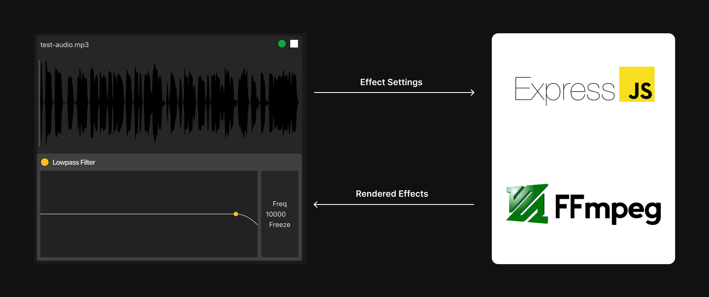

# Proof of Concept: Seamless Audio Effect Processing

This repository demonstrates a proof of concept (POC) for offloading real-time audio effect processing from the frontend to a backend server. The project features a **Vite React frontend** and an **Express backend**, showcasing seamless playback, audio processing, and crossfading.


---

## Features
- **Frontend**:
    - Built with React and Vite for fast and modern UI development.
    - Smooth playback of audio files with visualizers.
    - Crossfade transitions between original and processed audio.
- **Backend**:
    - Powered by Express for handling API requests.
    - Uses `ffmpeg` for audio effect processing.
    - Stores audio files in Supabase and generates public URLs.

---

## Project Structure
```plaintext
poc-audio-effect/
├── frontend/           # Vite React frontend
│   ├── src/            # Frontend source code
│   └── dist/           # Build output
├── backend/            # Express backend
│   ├── src/            # Backend source code
│   └── dist/           # Build output
├── package.json        # Root-level scripts and dependencies
├── .gitignore          # Ignore rules for the entire repository
└── README.md           # Project documentation
```
---

# Setup

## 1. Clone the Repository
Clone the repository to your local machine:
```bash
git clone https://github.com/your-username/poc-audio-effect.git
cd poc-audio-effect
```

## 2. Upload Audio File to Supabase

Before running the app, ensure that an audio file named `test-audio.mp3` is uploaded to the `audio-files` bucket in Supabase.

1. **Access Supabase Dashboard**  
   Log in to your Supabase account and open your project dashboard.

2. **Navigate to Storage**
    - Go to the **Storage** section in your Supabase dashboard.
    - Open an existing bucket named `audio-files`, or create a new bucket with the same name.

3. **Upload the Audio File**
    - Upload your audio file and ensure it is named **`test-audio.mp3`**.
    - Confirm the upload and ensure the file is accessible within the bucket.

The application is configured to use the bucket name `audio-files` and the file name `test-audio.mp3` for audio processing steps. Make sure these match exactly to avoid issues.


## 3. Development
Start the development servers for both the frontend and backend simultaneously:

```bash
npm run dev
